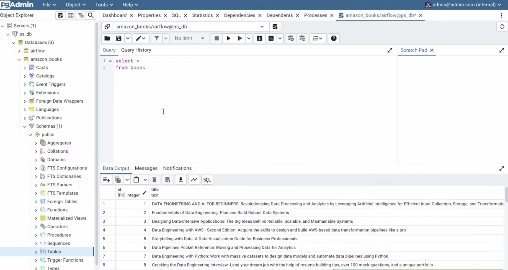
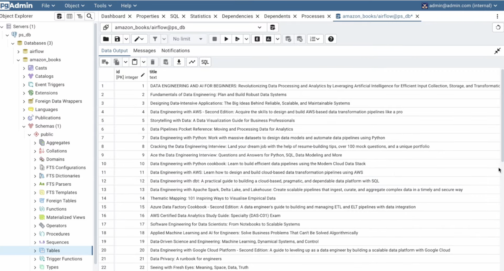

## Amazon Data Engineering Books ETL Pipeline (with Airflow + Docker)

This project is an Apache Airflow DAG running inside Docker to perform a simple ETL (Extract, Transform, Load) pipeline:

 1. Extract book data from Amazon (Data Engineering category)
 2. Transform the data (clean and deduplicate)
 3. Load it into a PostgreSQL table

This project is designed for educational purposes and demonstrates how to build and run Airflow ETL pipelines in a containerized environment using Docker.

---

## Features

- Scrapes Amazon for book titles, authors, prices, and ratings (data engineering books)
- Stores the cleaned data in a PostgreSQL database
- Uses BeautifulSoup, requests, and pandas in Python
- Airflow DAG composed of:
   - PythonOperator (extract + load)
   - PostgresOperator (create table)
   - PostgresHook (insert into PostgreSQL)
- Runs on Apache Airflow in Docker
---

## Database Output

1. A sample query and output from your PostgreSQL table

   

   
2. A screenshot showing 22 rows of book data

   
---

## DAG Tasks

1. fetch_book_data – Scrapes Amazon for book data
2. create_table – Creates a PostgreSQL table if it doesn’t exist
3. insert_book_data – Inserts data into the table using XCom

----

⚠️ Disclaimer

This project scrapes Amazon.com for educational purposes only.

It is intended to demonstrate ETL and Airflow concepts using publicly available data.

Amazon and the Amazon logo are trademarks of Amazon.com, Inc. or its affiliates.

Please refer to Amazon’s Terms of Service
 before using scraping in any commercial or production environment.

---
